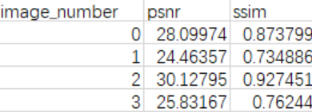

This is a script for batch evaluation of psnr and ssim indicators of reconstructed images. It is suitable for image compression, image restoration, super-resolution reconstruction, image denoising and other fields. Instead of needing a single image to calculate, all batches generate a csv table.

The usage is as follows:

python image_eval.py --orig_path 'orig' --recon_path 'recon'  --image_ format ‘bmp’

orig_path: the folder where the original images are placed

recon_path: the folder where the reconstructed images are placed

image_ format: The format of the image. 

Note: The original image must be named orig_0.~orig_n. The reconstructed image must be  named recon_0.~recon.n., and they must be one-to-one.
		The result is result.csv

